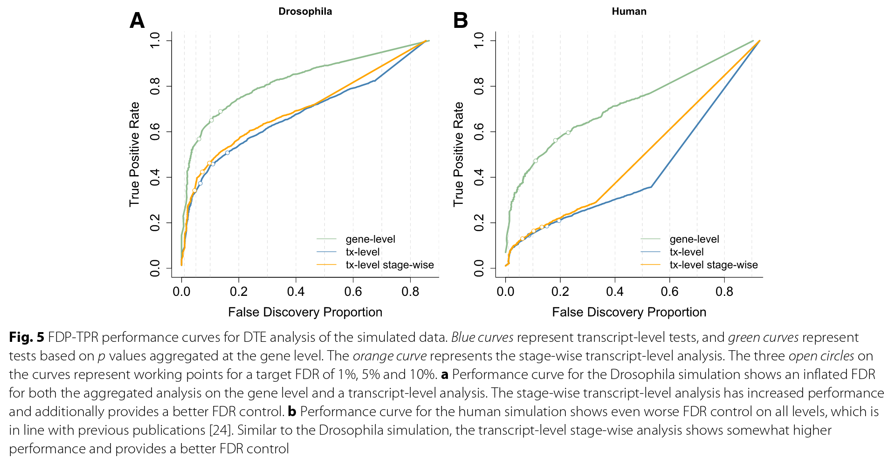
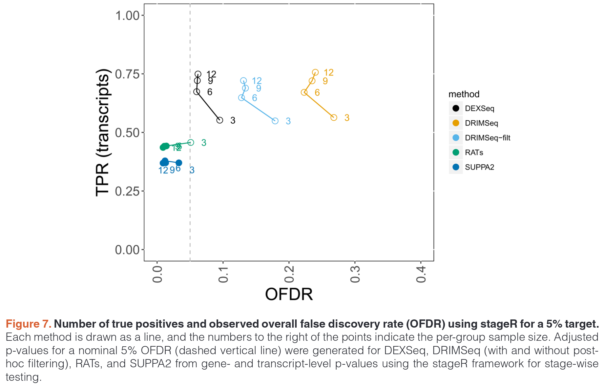

```{r setup, include=FALSE}
knitr::opts_chunk$set(message=FALSE,
                      warning=FALSE,
                      echo=TRUE
                      )
```
```{r libraries, echo=FALSE}
library(readr)
library(dplyr)
library(tidyr)
library(purrr)
library(tibble)
library(ggplot2)
library(ggrepel)
library(stringr)
library(aggregation)
library(hexbin)

library(GenomicFeatures)
library(vsn)
library(DESeq2)
library(DEXSeq)
library(DRIMSeq)
library(biomaRt)
library(IsoformSwitchAnalyzeR)
library(BSgenome.Hsapiens.UCSC.hg38)

```
```{css, echo=FALSE}
div.figure {
  display: block;
  text-align: center;
}
p.caption {
  font-size: 0.8em;
}

```


<!-- TODO : implémenter stageR pour DEXSeq -->
<!-- TODO : implémenter stageR pour Lancaster? Comme le gene level est censément meilleur -->
<!-- TODO : Faire une DGE classique pour la comparer à la sortie de Lancaster -->
<!-- TODO : Parler de faire des comptes Salmon pour comparer, notamment pour Lancaster -->
<!-- TODO : Pourquoi j'ai pas de normalisation? Il en faut? -->


```{r, echo=FALSE}
rld_pca <- function(rld, config, ntop = 500) {
  rv <- matrixStats::rowVars(assay(rld))
  selected_genes <- order(rv, decreasing = TRUE)[seq_len(min(ntop, length(rv)))]
  mat <- t(assay(rld)[selected_genes, ])
  pc <- prcomp(mat)
  eig <- (pc$sdev)^2
  variance <- eig * 100 / sum(eig)

  PCAdata <- as.data.frame(pc$x)
# Join with condition, on name, to be sure of matches between condition and sample
  PCAdata <- PCAdata %>%
    tibble::rownames_to_column(var = "sampleID") %>%
    inner_join(config, by = "sampleID") %>%
    tibble::column_to_rownames(var = "sampleID")
  list("data" = PCAdata, "variance" = variance)
}

plot_isoforms <- function(matrix_tx, txdf, genes) {
  plot_data <- matrix_tx %>%
    left_join(txdf %>% dplyr::rename("isoform_id" = "TXNAME", "gene_id" = "GENEID"), by = "isoform_id") %>%
    dplyr::filter(gene_id %in% genes) %>%
    mutate(delta = rowMeans(dplyr::select(., contains("delta"))),
           control = rowMeans(dplyr::select(., -contains("delta") & where(is.numeric)))) %>%
    dplyr::select(delta, control, isoform_id, gene_id) %>%
    pivot_longer(!c(isoform_id, gene_id), names_to = "condition", values_to = "mean")
    
  plot_tx <- ggplot(plot_data, aes(x = isoform_id, y = mean, fill = condition)) +
    geom_bar(stat = "identity", position = "dodge") 
  if(length(genes) == 1) {
    plot_tx <- plot_tx +
      scale_x_discrete(guide = guide_axis(n.dodge = 2)) +
      facet_wrap(~gene_id, scales = "free_x")
  } else if (length(genes) < 8) {
    plot_tx <- plot_tx +
      scale_x_discrete(guide = guide_axis(angle = 45)) +
      theme(axis.text.x = element_text(size = 5)) +
      facet_wrap(~gene_id, scales = "free")
  } else {
    plot_tx <- plot_tx +
      theme(axis.text.x = element_blank()) +
      facet_wrap(~gene_id, scales = "free")
  }
  
  plot_tx
}
```


## Introduction

Ce projet a pour but d'explorer plusieurs méthodes d'analyse d'analyse différentielle de l'épissage entre deux conditions, avec >= 3 réplicats. Les données de comptages sont obtenues grace à du séquençage long read sur ONT. Cette version explore les données de Corentin Aubé sur deux infections de cellules par deux VIH différents, séquencées en MinION. Il doit servir de *toy dataset* pour le futur projet de l'équipe de Sarah Gallois-Montbrun.

J'ai relevé trois niveaux d'analyse pour étudier les différences d'épissage entre deux conditions : 

- étudier le DTU, *Differential Transcript Usage*, qui consiste à observer les changements dans l'expression relative entre des isoformes d'un gène. Une limite potentielle est que si le test est implémenté sous la forme de ratio, cette méthode est sensible à des variations dans les isoforms de faible expression. L'hypothèse nulle à rejeter est que les proportions (en cas de ratio) ou les différences entre les transcrits d'un même gène restent les mêmes à travers les conditions.

- étudier le DTE, *Differential Transcript Expression*, c'est à dire comme l'analyse classique RNA-Seq mais au niveau transcrit. Les limitations de cette méthode est le manque potentiel de puissance statistique (augmentation du nombre de variables par rapport au niveau gène, sans augmenter le nombre de réplicats). L'hypothèse nulle à rejeter est l'égalité des valeurs d'expression des transcrits à travers les conditions, et l'est plus fréquemment que la précédente, par exemple si la répartition entre transcrits reste identique mais le gène est plus exprimé en général.

- étudier le GDE, *Gene differential expression*, comme défini par Lior Pachter [ici](https://liorpachter.wordpress.com/2018/02/15/gde%C2%B2-dge%C2%B2-dtu%C2%B2-dte%E2%82%81%C2%B2-dte%E2%82%82%C2%B2/) (article de blog dont la lecture est très éclairante), mais qu'il est impossible d'appliquer dans le contexte du bulk RNA-seq.


La principale limite à l'exploration des transcrits entre deux conditions est la faible puissance statistique à ce niveau de résolution. Le taux de fausse découverte (FDR) est souvent très important comparé au taux de vrai positif (TPR), comme démontré dans des simulations réalisées par [Van den Berge et al](https://genomebiology.biomedcentral.com/articles/10.1186/s13059-017-1277-0). 


On note ici qu'en particulier dans un transcriptome aussi complexe que celui de l'humain, l'analyse niveau transcrit peine à être performante, et il vaut mieux regarder les transcrits agrégés au niveau du gène (courbe verte), et obtenir une liste de gènes perturbés. En effet, lorsqu'on descend au niveau du transcrit pour établir lequel cause cette perturbation au niveau du gène, la performance s'effondre.

Pour réaliser l'inférence statistique, j'ai pour le moment identifié trois méthodes : 

- DEXSeq après un filtre avec DRIMSeq, qui est une méthode de *Differential Transcript Usage*. Permet de rejeter l'hypothèse que la répartition entre les isoformes est inchangée entre les deux conditions. J'y utilise sa méthode d'agrégation niveau gène afin de limiter la baisse de performance. C'est donc une méthode DTU->G.

- Une méthode d'agrégation DTE->G, la méthode de Lancaster pour aggréger les résultats de DTE obtenus avec DESeq2 au niveau gène. Si la *p-value* ajustée est inférieure à un seuil déterminé, elle rejete l'hypothèse qu'aucun isoforme ne bouge entre les deux conditions. C'est une hypothèse nulle plus forte, potentiellement plus intéressante à rejeter que la précédente, mais peut-être moins adaptée à notre problématique. En outre, en la rejetant au niveau de l'agrégation, on n'a pas non plus l'information sur quel est le transcrit qui a motivé ce rejet.

- Finalement il existe aussi l'implémentation IsoformSwichAnalyzeR de la première méthode. Il est difficile de vérifier si elle est exactement identique (elle semble utiliser des fractions plutôt que des différences), mais il est certain qu'elle possède un filtre différent. En outre, elle ne fait pas appel à de l'agrégation, et donc peut avoir les problèmes de performance qui y sont liés.

## EDA
La première étape est une exploration du jeu de données.
```{r}
samplesheet <- read_tsv(params$design)
matrix_tx <- read_tsv(params$quants)
samplesheet <- tibble(samplesheet, "tx_mat_name" = colnames(matrix_tx)[-1])
colnames(matrix_tx) <- c("isoform_id", samplesheet$Description)
design_matrix <- samplesheet %>% dplyr::select(Condition, Description) %>% dplyr::rename(sampleID = Description, condition = Condition)
design_matrix$condition <- case_match(design_matrix$condition,
                                      "GVTat" ~ "control",
                                      "GVdeltaTat" ~ "delta")
```
```{r, fig.cap="Distribution des comptes par échantillon"}
matrix_tx %>%
  pivot_longer(!isoform_id, names_to = "sampleID") %>%
  left_join(design_matrix, by = "sampleID") %>%
  ggplot(aes(x = sampleID, y = value, fill = condition)) +
  geom_violin(draw_quantiles = c(0.25, 0.5, 0.75)) +
  scale_y_log10()
```

Il semble que les librairies n'ont pas la même profondeur , en particulier GVTat 4 et 5. Il faut normaliser par la profondeur de séquençage, ceci est fait par DESeq2 par défaut, et donc par DEXSeq également qui adapte DESeq2, et également par IsoformSwitchAnalyzeR, qui utilise DEXSeq.

```{r}
exploratory_dds <- DESeqDataSetFromMatrix(round(matrix_tx %>% column_to_rownames("isoform_id") %>% as.matrix),
                                          colData = design_matrix %>% column_to_rownames("sampleID"),
                                          ~ condition)
exploratory_dds <- estimateSizeFactors(exploratory_dds)
```


<!-- Ces distributions semblent relativement proche. Nous pouvons également nous intéresser au lien entre la variance et la moyenne, problème bien connu des données de RNA-Seq au niveau gène. -->
<!-- ```{r} -->
<!-- # DESeq2::plotDispEsts(exploratory_dds, ymin = 0e-08) -->
<!-- # Error in class(x) <- unique.default(c("AsIs", oldClass(x))) :  -->
<!-- #   attempt to set an attribute on NULL -->
<!-- ``` -->

<!-- ```{r} -->
<!-- library(vsn) -->
<!-- library(hexbin) -->
<!-- meanSdPlot(assay(normTransform(exploratory_dds))) -->
<!-- ``` -->

<!-- ```{r} -->
<!-- meanSdPlot(assay(rlog(exploratory_dds))) -->
<!-- ``` -->
<!-- ```{r} -->
<!-- meanSdPlot(assay(vst(exploratory_dds))) -->
<!-- ``` -->

<!-- Ces trois visualisations nous indique que le lien de la variance avec la moyenne de nos comptes de transcrits est assez faible quelque soit la transformation, et que la transformation la plus pertinente semble la transformation log la plus classique -->

```{r}
log_tr <- normTransform(exploratory_dds)
pca_data <- rld_pca(log_tr, design_matrix)#, nrow(log_tr))
```

```{r pca_counts, fig.cap="ACP des échantillons delta tat et contrôle"}
plot_res <- ggplot(
  pca_data$data,
  aes(
    x = PC1,
    y = PC2,
    label = rownames(pca_data$data)
  )
) +
  ylab(paste0("PC2: ", round(pca_data$variance[2], 1), "% variance")) +
  xlab(paste0("PC1: ", round(pca_data$variance[1], 1), "% variance")) +
  coord_fixed() +
  geom_point(aes(color = condition), size = 5) +
  geom_label_repel()
plot_res
```

On observe sur cette PCA que les deux conditions semblent malheureusement se recouvrir, notamment à cause d'un échantillon particulier (GVTat_2) du groupe contrôle. Si dans un cas général nous ne poursuivrions peut-être pas l'analyse, ici, comme le but est de tester des méthodes, nous allons continuer.

## DTU->G avec DEXSeq et DRIMSeq

### Filtrer avec DRIMSeq

La première analyse statistique des gènes exhibant un *differential transcript usage* est basée sur [Love et al.](https://f1000research.com/articles/7-952/v3). Ce workflow utilise DRIMSeq pour filtrer les transcrits, avant d'utiliser DEXSeq pour l'inférence, puis StageR pour une inférence à deux niveaux : *"A typical analysis of differential transcript usage would involve asking first: “which genes contain any evidence of DTU?”, and secondly, “which transcripts in the genes that contain some evidence may be participating in the DTU?”"*. Un gène peut passer le premier test (réalisé avec DEXSeq) mais pas le second. Selon les auteurs, cette méthode permet de mieux contrôler le FDR (False Discovery Rate). La méthode de stageR est recommandée par les auteurs, mais pas encore implémentée dans ce rapport pour le moment.

La première étape de ce pipeline implique de construire un lien entre noms de transcrits, que nous avons, et noms de gènes. Ceci est compliqué par le fait que nous avons utilisé la découverte de transcrit avec Isoquant, ce qui fait qu'un simple fichier d'annotation standard ne suffit pas. Donc nous allons utiliser le package `GenomicFeatures` pour importer le fichier gtf construit par Isoquant, sous la forme d'un objet TxDb. 

```{r}
gtf <- params$gtf
txdb_filename <- "transcript_models.sqlite"
txdb <- makeTxDbFromGFF(gtf)
invisible(saveDb(txdb, txdb_filename))
txdf <- AnnotationDbi::select(txdb, keys(txdb, "GENEID"), "TXNAME", "GENEID")
# tab <- table(txdf$GENEID) not used?
# txdf$ntx <- tab[match(txdf$GENEID, names(tab))]
```

```{r}
# sanity checks from paper
# cts_matrix <- matrix_tx %>% column_to_rownames("isoform_id") %>% as.matrix()
# all(rownames(cts_matrix) %in% txdf$TXNAME)
# txdf <- txdf[match(rownames(cts_matrix),txdf$TXNAME),]
# all(rownames(cts_matrix) == txdf$TXNAME)
counts <- left_join(
    matrix_tx %>% dplyr::rename("feature_id" = "isoform_id"),
    txdf %>% dplyr::rename("feature_id" = "TXNAME"),
    by = "feature_id") %>%
  dplyr::rename("gene_id" = "GENEID") %>%
  relocate(gene_id, .after = feature_id)
```
Nous commençons donc par filtrer les données via DRIMSeq. Il y a trois filtres dans le workflow original :

- minimum de comptage de transcrit de 10 dans au moins 3 échantillons

- minimum de 10% du transcrit relatif au gène dans au moins 3 échantillons

- minimum de comptage du gène de 10 dans les 6 échantillons.

Ce sont les filtres du workflow modèle, mais nous allons utiliser 3, 10% et 3 dans notre cas car il y a très peu de profondeur. Sur des données PromethION, nous pourrions utiliser des filtres plus proches de ceux recommandés dans l'article de Love et al.

```{r}
drim <- dmDSdata(counts = counts %>% as.data.frame(),
                 samples = design_matrix %>% dplyr::rename("sample_id" = "sampleID") %>% as.data.frame())
drim <- dmFilter(
  drim,
  min_samps_feature_expr = 3, min_feature_expr = 3,
  min_samps_feature_prop = 3, min_feature_prop = 0.1,
  min_samps_gene_expr = 6, min_gene_expr = 3
)
```

Le nombre de gènes est très fortement diminué, divisé par ~ 5, malgré des filtres permissifs. Mais sur des données plus profondes, cela pourrait être moins drastique. Les gènes n'ayant qu'une isoforme sont évidemment éliminés, car leur proportion ne change pas entre deux conditions.

Le worklow continue en utilisant DRIMSeq pour la partie inférence, mais qui est *in fine* jugé moins performant. Nous n'utiliserons que DEXSeq pour la partie inférence.

### Inférence avec DEXSeq

```{r}
sample_data <- DRIMSeq::samples(drim)
count_data <- round(as.matrix(counts(drim)[, -c(1, 2)]))
dex <- DEXSeqDataSet(
  countData = count_data,
  sampleData = sample_data,
  design = ~ sample + exon + condition:exon,
  featureID = counts(drim)$feature_id,
  groupID = counts(drim)$gene_id
)
```
```{r}
dex <- DEXSeq::estimateSizeFactors(dex)
dex <- DEXSeq::estimateDispersions(dex)
dex <- DEXSeq::testForDEU(dex, reducedModel = ~ sample + exon)
```

 
```{r}
dex_res <- DEXSeqResults(dex, independentFiltering = FALSE)
qval <- perGeneQValue(dex_res)
dex_res_g <- data.frame(gene = names(qval), qval)
```
```{r, fig.cap="Gènes dont des transcrits sont différentiellement exprimés selon DEXSeq"}
genes_sig <- dex_res_g %>% filter(qval < 0.05) %>% pull(gene)
plot_isoforms(matrix_tx, txdf, genes = genes_sig)
```
On observe qu'un seul gène est mis en avant par DEXSeq, après agrégation. Avant agrégation, il y avait trois transcrits, dont deux appartenant à un même autre gène (donc deux gènes au total).

Dans le cas de la figure ci-dessus, on pourrait penser que le transcrit le plus significatif pour l'usage différentiel serait le premier à gauche, mais si l'on observe les tests au niveau transcrit, c'est le troisième en partant de la gauche qui est significatif à $\alpha < 0.05$. Le fait de revenir au niveau transcrit de cette manière-ci, après agrégation, n'est pas correct statistiquement (et potentiellement faux, comme il a été démontré par Van Den Berge), et pour obtenir ce niveau de résolution une étape additionelle comme le package stageR pourrait être envisagée, pour un gain modeste mais réel de performance.
<!--  mais en observant les transcrits différentiellement exprimés, il existe un second gène dont l’agrégation niveau gène n'est pas significative, mais avec deux transcrits possédant un usage différentiel. -->

<!-- ```{r, fig.cap="Gènes non significatifs, mais possédant des transcrits siginificatifs"} -->
<!-- genes_tr_sig <- dex_res %>% -->
<!--   as.data.frame() %>% -->
<!--   filter(padj < 0.05) %>% -->
<!--   pull(groupID) -->
<!-- tr_sig_not_genes <- setdiff(genes_tr_sig, genes_sig) -->
<!-- plot_isoforms(matrix_tx, txdf, tr_sig_not_genes) -->
<!-- ``` -->


<!-- ```{r} -->
<!-- # Pour avoir la liste des transcrits, mais pourquoi pvalue et not padj??-> pour stageR? -->
<!-- columns <- c("featureID","groupID","pvalue") --> 
<!-- dxr_sub <- as.data.frame(dex_res[,columns]) -->
<!-- head(dxr_sub) -->
<!-- ``` -->

<!-- Visuellement, les deux gènes indiqués semblent bien différentiellement exprimés, dans des sens opposés. Le second apparaît même comme plus convaincant que le premier, mais comme nous n'avons pas représenté les valeurs de dispersions, qui peuvent être la raison pour laquelle il n'est pas significatif au niveau gène. -->

<!-- Nous  continuons l'implémentation de ce *workflow* en utilisant StageR -->

## DTE->G avec DESeq2 et agrégation via la méthode de Lancaster

Cette version de l'inférence statistique se base sur l'article de [Yi et al](https://genomebiology.biomedcentral.com/articles/10.1186/s13059-018-1419-z). Il s'agit de faire une analyse tout d'abord au niveau transcrit (DTE) via DESeq2 (sleuth dans l'article, mais le code est adapté de leur comparaison avec DESeq2), et ensuite de l'agréger au niveau gène via la méthode de Lancaster, qui semble selon l'article plus adapté que la méthode de Sirak, qui est celle de la méthode `perGeneQValue` de DEXSeq, qui permet de résumer l'information transcrit au niveau gène. Cela permet entre autre de disposer d'une liste de gènes classés par ordre de perturbation, ce dont on ne disposerait pas si on utilisait uniquement la liste de transcrits, et bien sûr de mieux contrôler le FDR. Cette méthode permet aussi de récupérer les gènes monotranscrits, notamment ceux nouvellement identifiés par Isoquant, contrairement à DEXSeq.

Sans utiliser le filtre DRIMSeq, on obtient le résultat suivant : 

```{r}
agg_dds <- DESeqDataSetFromMatrix(
  round(matrix_tx %>% column_to_rownames("isoform_id") %>% as.matrix),
  colData = design_matrix %>% column_to_rownames("sampleID"),
  ~ condition
)
agg_dds <- DESeq(agg_dds)
agg_res <- as.data.frame(DESeq2::results(agg_dds))
```

```{r}
agg_res$transcript <- rownames(agg_res)
agg_res_joined <- left_join(agg_res, txdf %>% dplyr::rename("transcript" = "TXNAME", "gene" = "GENEID"), by = "transcript")
agg_res_joined <- dplyr::select(agg_res_joined, gene, pvalue, baseMean)
agg_summary <- agg_res_joined %>% group_by(gene) %>%
  summarise(n = n(),
            lancaster_pval = lancaster(pvalue, baseMean),
            sidak_pval = sidak(pvalue))
agg_summary$lancaster_padj <- p.adjust(agg_summary$lancaster_pval, "BH")
```

```{r, fig.cap="Gènes identifiés par la méthode d'agrégation de Lancaster, données non filtrées"}
genes_lanc <- agg_summary %>%
  filter(lancaster_padj < 0.05) %>%
  pull(gene)
plot_isoforms(matrix_tx, txdf, genes_lanc)
```

On observe que cette méthode identifie des gènes différents de DEXSeq. Les transcrits de tous ces gènes semblent être modifiés dans une direction identique, contrairement à DEXSeq qui semble identifier des (deux) gènes dont les proportions sont modifiées entre deux conditions. Selon l'article de Yi et al, on devrait également retrouver des gènes dont les transcrits bougent dans des directions différentes, mais ce n'est pas le cas dans nos résultats.

L'agrégation des résultats au niveau du gène permet par la suite de faire de l'enrichissement sur cette liste comme avec celle de DEXSeq. C'est implémenté dans l'article de Yi et al, et nous pourrions faire de même.

 On peut également utiliser en entrée les transcrits filtrés par DRIMSeq, mais nous perdons donc dans ce cas-ci les gènes possédant un unique transcrit.
  
```{r}
agg_dds_filter <- DESeqDataSetFromMatrix(round(counts(drim) %>% column_to_rownames("feature_id") %>% dplyr::select(-gene_id)),
                                          colData = design_matrix %>% column_to_rownames("sampleID"),
                                          ~ condition)
agg_dds_filter <- DESeq(agg_dds_filter)
agg_res_filter <- as.data.frame(DESeq2::results(agg_dds_filter))
```

```{r}
agg_res_filter$transcript <- rownames(agg_res_filter)
agg_res_filter_joined <- left_join(agg_res_filter, txdf %>% dplyr::rename("transcript" = "TXNAME", "gene" = "GENEID"), by = "transcript")
agg_res_filter_joined <- dplyr::select(agg_res_filter_joined, gene, pvalue, baseMean)
agg_filter_summary <- agg_res_filter_joined %>% group_by(gene) %>%
  summarise(n = n(),
            lancaster_pval = lancaster(pvalue, baseMean),
            sidak_pval = sidak(pvalue))
agg_filter_summary$lancaster_padj <- p.adjust(agg_filter_summary$lancaster_pval, "BH")
```


```{r, fig.cap="Gènes identifiés par la méthode d'agrégation de Lancaster, données filtrées"}
genes_lanc_fil <- agg_filter_summary %>%
  filter(lancaster_padj < 0.05) %>%
  pull(gene)
plot_isoforms(matrix_tx, txdf, genes_lanc_fil)
```

On observe (heureusement) une assez forte correspondance entre les gènes identifiés en partant des deux jeux de données, filtrés ou non. On note qu'en utilisant les données filtrées, nous obtenons plus de gènes avec cette méthode. Cela est certainement liée à un gain de sensitivité lié à une correction de test multiple moins drastique que précédemment.
Étonnamment, cette méthode ne semble identifier que des gènes/transcrits surexprimés dans delta tat par rapport au contrôle. En prenant le top 30 des gènes selon leur p-valeur, il est possible de vérifier s'il y a eu une erreur de manipulation de notre part, ou si ceci est lié au hasard, ou encore à une réalité biologique.

```{r, fig.cap="Top 30 des gènes selon leur pvaleur"}
top_diff_genes <- agg_filter_summary %>% slice_min(lancaster_pval, n = 30) %>% pull(gene)
plot_isoforms(matrix_tx, txdf, top_diff_genes)
```
En représentant le top 30 des gènes selon la pvaleur (Lancaster), on observe que la plupart des gènes semblent appartenir à la même catégorie que les 6 réellement significatifs à $\alpha < 0.05$, de gènes qui sont en général plus exprimés. On observe que si la majorité des gènes identifiés montrent des gènes qui sont plus exprimés dans delta que dans le contrôle, il en existe aussi dans l'autre sens. La plupart indiquent des gènes dont les transcrits sont *unanimes*, à rebours de ce que mettait en avant Yi et al. Je peux trouver deux explications à cette différence inattendue : 

- La découverte de nouveaux transcrits d'Isoquant crée de nombreux faux positifs qui sont en fait des transcrits déjà connus, et qui suivent très logiquement la même dynamique que les *"vrais"* transcrits. Donc cette relative unanimité est le fruit de l'imprécision de Nanopore couplée à la découverte tolérante de nouveaux transcrits d'Isoquant.

- Le nombre de réplicats pourrait être une différence entre les figures de l'article et les nôtres. Mais il me semble que c'est du 3v3.

- Yi et al mettent en avant des exemples assez rares en général.


Comme pour DEXSeq, la limite principale de cette méthode est l'impossibilité d'identifier un seul transcrit à la source de la perturbation dans un gène significatif, sacrifice nécessaire pour conserver une performance correcte. Mais de la même manière que DEXSeq, il serait possible d'utiliser une méthode telle que stageR pour descendre au niveau de résolution inférieur.

## Inférence avec IsoformSwitchAnalyzeR

Normalement, cette méthode devrait donner des résultats identiques à DEXSeq en mode transcrit (puisque c'est un wrapper de cette méthode), la première méthode testée ici, si l'on utilise des filtres identiques (ce qui est presque possible). Ses auteurs mettent en avant que c'est plutôt une méthode pour l'analyse *downstream* que pour l'inférence statistique, qui répond à la question : que conclure une fois que l'on a identifié des transcrits utilisés différemment? Ce package pourrait également nous servir afin de compléter l'information fournie par l'enrichissement obtenu après DESeq2 + Lancaster + stageR.

```{r}
switchList <- importRdata(
  isoformCountMatrix = matrix_tx,
  designMatrix = design_matrix,
  isoformExonAnnoation = params$gtf,
  quiet = TRUE
)
switchListFiltered <- preFilter(
  switchAnalyzeRlist = switchList,
  geneExpressionCutoff = 1,
  isoformExpressionCutoff = 1,
  IFcutoff = 0.1,
  removeSingleIsoformGenes = TRUE,
  quiet = TRUE
)
switchListAnalyzed <- isoformSwitchTestDEXSeq(
  switchAnalyzeRlist = switchListFiltered,
  reduceToSwitchingGenes = TRUE,
  quiet = TRUE
)

isar_result <- left_join(switchListAnalyzed$isoformSwitchAnalysis,
                         txdf %>% dplyr::rename("gene_id" = "GENEID", "isoform_id" = "TXNAME"),
                         by = "isoform_id")
```

Les résultats sont en effet très proches de ceux identifiés par la première méthode, ce qui est attendu. 

```{r, fig.cap="Transcrits identifiés par ISAR, représentés dans le contexte de leurs gènes"}
isar_genes <- isar_result %>%
  filter(padj < 0.05) %>%
  pull(gene_id) %>%
  unique()
plot_isoforms(matrix_tx, txdf, isar_genes)
```
IsoformSwitchAnalyzeR ne dispose pas de méthode d'agrégation, donc impossible de classer les gènes par ordre d'importance/significativité. Il est uniquement possible d'afficher les gènes possédant des transcrits différentiellement exprimés, et de classer directement ces derniers. Ceci peut compliquer l'enrichissement par la suite, et souffre des problèmes de performance identifié par [Van den Berge et al](https://genomebiology.biomedcentral.com/articles/10.1186/s13059-017-1277-0). 

## Discussion

Pour cette analyse, on observe que les deux principales méthodes donnent des résultats différents. Ceci est cependant attendu, car l'EDA, en particulier la PCA, indiquait qu'il y avait un faible regroupement des échantillons selon leur condition. De plus, étant donné le faible nombre de transcrits exprimés significativement (autour de 7000 après un filtre permissif avec DRIMSeq), on pouvait s'attendre à une certaine variabilité entre les méthodes qui peuvent être sensibles différemment aux outliers.

On observe un gène identifié par DEXSeq après filtre par DRIMSeq, 4 par la méthode d'agrégation de Lancaster (non-filtrée), puis 6 par la même méthode en utilisant le filtre DRIMSeq, et enfin 3 transcrits selon IsoformSwitchAnalyzeR. 

Le gène de DEXSeq est retrouvé IsoformSwichAnalyzeR, ce qui est normal si l'on tient compte du fait qu'IsoformSwitchAnalyzeR utilise DEXSeq en mode transcrit, la seule étape différente étant normalement le filtre préalable et l'agrégation.

Les deux possibilités identifiées ici semblent donc DTU->G et DTE->G. Le rejet de l'hypothèse nulle dans le cas du second est plus fort, il indique qu'au moins un transcrit bouge (de manière absolue) dans un gène entre deux conditions, tandis que le rejet de l'hypothèse nulle dans le premier cas indique que la proportion d'un transcrit a changé dans un gène entre les deux conditions. En fonction de la question la plus pertinente dans notre cas, l'une ou l'autre méthode pourrait être plus pertinente. Il me semble que la question de la proportion est plus proche de notre questionnement dans le cadre du projet, donc je pense que DEXSeq pourrait être la méthode la plus pertinente. Mais il est difficile avec des résultats si peu nombreux de tirer des conclusions générales.

Si DEXSeq était sélectionné, alors la question de sa méthode d'agrégation pourrait être soulevée. Celle-ci, la méthode de Šidák, considère que les tests individuels sur les transcrits sont indépendants, une hypothèse que ne fait pas de la méthode Lancaster. Peut-être serait-il possible d'utiliser la seconde pour agréger les résultats niveau transcrit de DEXSeq, mais comme elle n'est pas implémentée dans le package initial, la rajouter demanderait de nombreuses précautions pour être certain de bien respecter les hypothèses sous-tendues par la méthode.


## Perspective


En l'absence de données plus proches en volume de celle que l'on pense obtenir à la fin du séquençage, il me semble plus prudent de conserver toutes ces méthodes dans notre analyse, ou au minimum DEXSeq et DESeq2 + Lancaster (soit DTU->G et DTE->G). Peut-être qu'une étape de simulation pour mieux discerner la meilleure de ces méthodes pourrait être pertinente, mais ce serait un projet potentiellement trop long pour le temps restant. Avec un réplicat de plus, nos analyses pourraient aussi être plus fiable, ceci avait été montré par les benchmarks via simulation de Love et. al.



En utilisant l'agrégation des tests niveau transcrit au niveau gène, on fait le sacrifice de la résolution pour la précision, et éviter un taux trop élevé de fausses découvertes. Mais ce choix ne nous permet pas de répondre à l'enjeu initial, qui est d'identifier des transcrits. Une méthode, statistiquement légèrement plus fiable, mise au point par [Van den Berge et al](https://genomebiology.biomedcentral.com/articles/10.1186/s13059-017-1277-0), stageR, permet de redescendre ensuite au niveau transcrit. La prochaine étape serait donc probablement de l'implémenter dans chacun des deux cas.

J'ai précédemment mentionné que la découverte de nouveaux transcrits permise par les méthodes telles qu'Isoquant ou Bambu pouvait poser problème pour la performance des méthodes statistiques. En particulier, ajouter des transcrits nouvellement découverts augmente le nombre de tests statistiques à réaliser, et induit donc une correction de test multiple plus importante, notamment si l'on utilisait directement les résultats DTE et DGU. Cependant, il me semble qu'en utilisant l'agrégation, puis redescendant au niveau transcrit via stageR, cette contrainte serait moindre. Il pourrait être intéressant de tester cette hypothèse en réalisant parallèlement une quantification via Salmon, ou Isoquant sans découverte de transcrit. Ceci pourrait cependant nous faire rater des isoformes/exons non présents dans les bases de données qui seraient potentiellement intéressants dans le cas de la latence virale. Il me semble que l'équipe d'Alice Lebreton n'avait pas utilisé l'option de découverte de nouveaux transcrits de Bambu.

Une des questions importantes pour le choix de méthode est également l'exploitation *downstream* des listes de gènes/transcrits. Si l'on part du principe que de nombreux gènes/transcrits vont être identifiés (500 gènes n'est pas hors du commun en RNA-Seq classique), l'enrichissement via ORA/GSEA, qui se servira des annotations disponibles dans les bases de données pourrait être primordial, pour faire le tri dans cette grande quantité d'information. Or, comme les transcrits sont rarement annotés, une méthode d’agrégation sera importante à ce moment là. Une fois la liste de gènes d'intérêt resserrée, il s'agira d'obtenir de l'information sur les différences biologiques entre transcrits. Pour cette partie, ISAR semble être très intéressant, proposant des figures déjà prêtes et permettant d'intégrer des bases de données, de familles protéiques par exemple. Mais si le nombre de transcrits que l'on souhaite disséquer est faible, il est toujours possible de réaliser cette étape à la main, et se passer de la lecture du manuel assez épais d'IsoformSwitchAnalyzeR. Cette approche pourrait être complémentée grâce à `gget`, outil qui permet de réunir de nombreuses informations issues de base de données génomiques, blast, UniProt...

Pour ces deux possibilités d'analyse des résultats de l'inférence statistique, je ne peux pas les tester sur les données de délétion de Tat étant donné le faible nombre de gènes/transcrits identifiés. Je pourrais cependant essayer de récupérer des données, pour appliquer les deux méthodes successivement, et vous présenter un autre rapport pour évaluer si c'est le type de résultats qui a du sens pour vous.

Pour résumer, les prochaines étapes pourraient être pertinentes : 

- Redescendre au niveau transcrit avec stageR

- Tester les méthodes citées d'enrichissement des résultats.

- Potentiellement essayer de quantifier en utilisant Salmon/Isoquant sans découverte de nouveau transcrit, et observer l'impact sur les résultats.